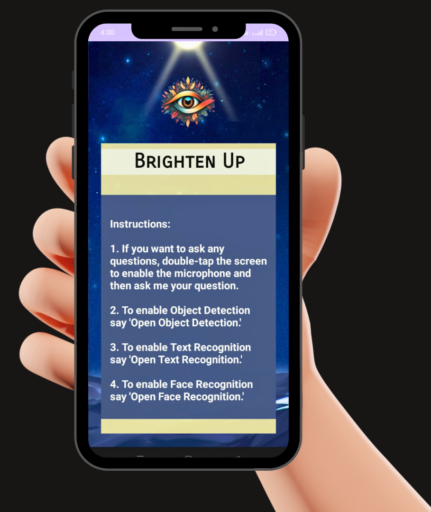
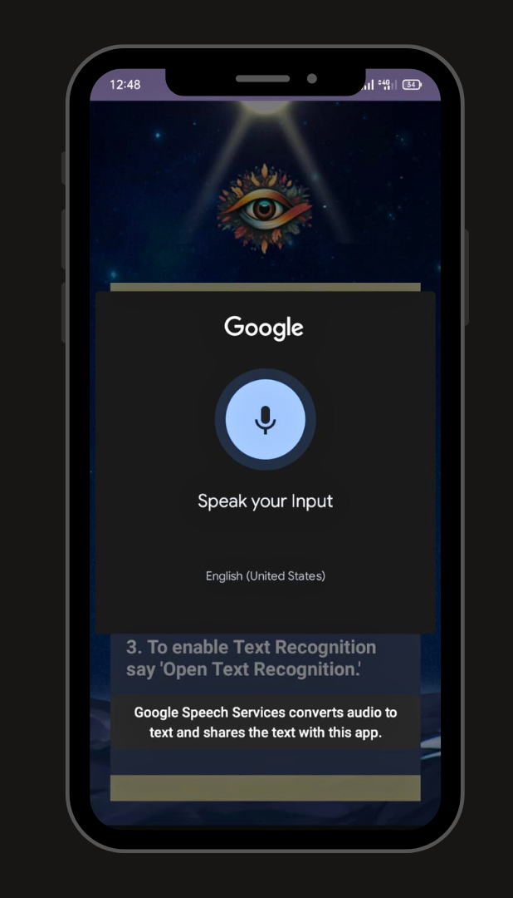
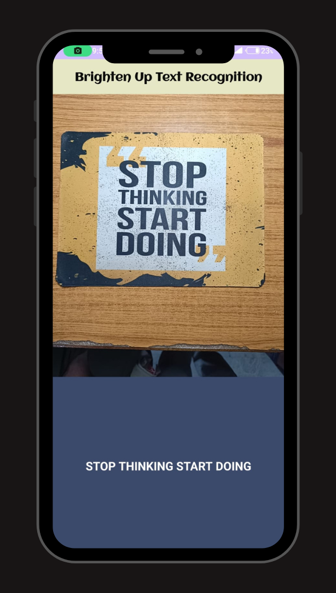
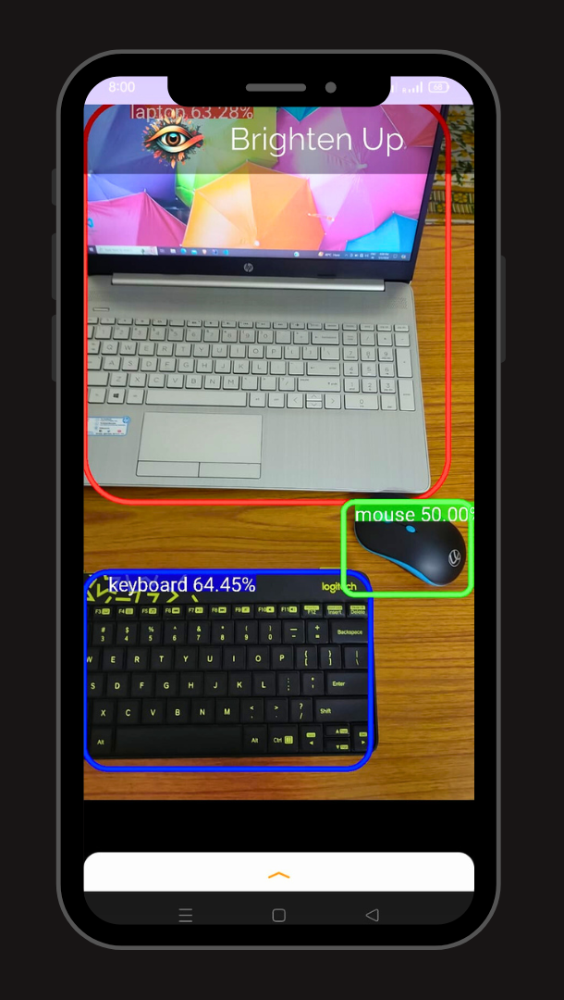
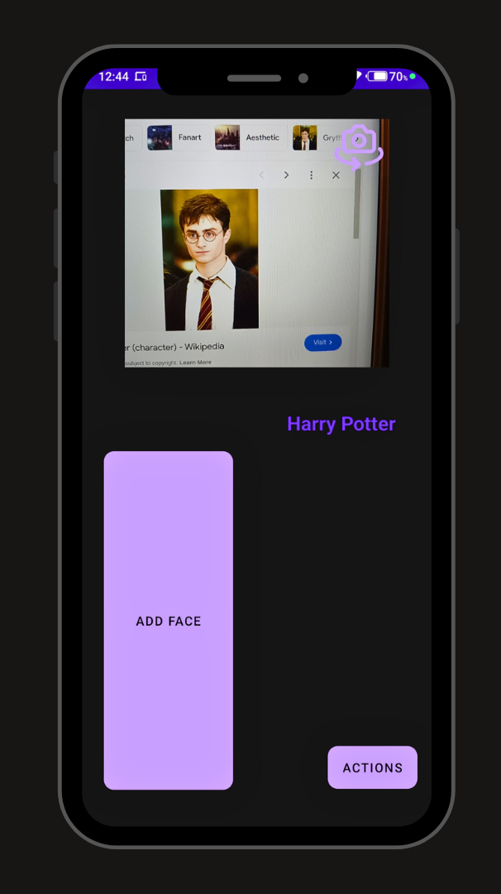

# BrightenUp

**BrightenUp** is an Android application designed to assist visually impaired individuals by providing features such as Text Recognition, Object Detection, Face Recognition, and an AI Chatbot. This app aims to enhance the independence and quality of life for users by leveraging advanced AI technologies.

## Table of Contents
- [Features](#features)
- [Installation](#installation)
- [Usage](#usage)
- [Screenshots](#screenshots)
- [Contributing](#contributing)

## Features

- **Text Recognition**: Reads text from images or live camera feed, helping users to read printed materials like books, signs, and menus.
- **Object Detection**: Identifies objects in the surroundings, providing audio descriptions to help users navigate their environment.
- **Face Recognition**: Recognizes familiar faces, offering a way to identify people in the user's vicinity.
- **AI Chatbot**: Engages in conversations with users, offering assistance, information, and companionship.

## Installation

1. Clone the repository:
    ```sh
    git clone https://github.com/yourusername/BrightenUp.git
    ```

2. Open the project in Android Studio.

3. Build and run the project on an Android device or emulator.

## Usage

1. Launch the **BrightenUp** app on your Android device.
2. Navigate through the features using the main menu.
3. Follow on-screen instructions to use Text Recognition, Object Detection, Face Recognition, and the AI Chatbot.

## Screenshots






## Contributing

Contributions are welcome! Please follow these steps to contribute:

1. Fork the repository.
2. Create a new branch (`git checkout -b feature-branch`).
3. Make your changes.
4. Commit your changes (`git commit -m 'Add some feature'`).
5. Push to the branch (`git push origin feature-branch`).
6. Open a pull request.
